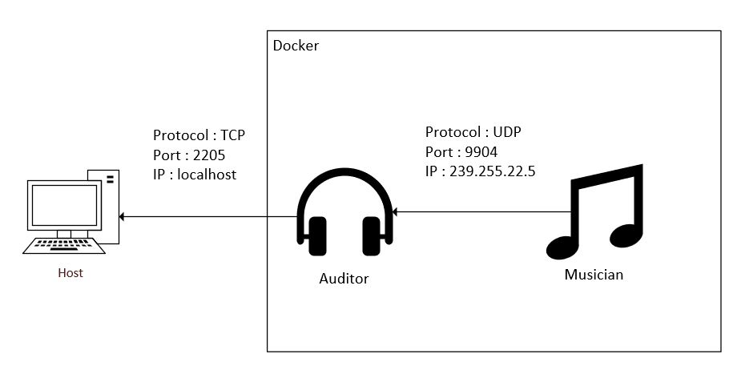

DAI Lab - UDP orchestra
=======================

Objectives
----------

This lab has 2 objectives:

* The first objective is to **design and implement a simple application protocol on top of UDP**. It will be very similar to the protocol presented during the lecture (where thermometers were publishing temperature events in a multicast group and where a station was listening for these events).

* The second objective is to continue practicing with **Docker**. You will have to create 2 Docker images (they will be very similar to the images presented in class). You will then have to run multiple containers based on these images.


Organization
------------

* **You can work in groups of 2 students**.
*  You can fork this repository or manually copy it to your private respository. However, you have to **use exactly the same directory structure for the validation procedure to work**. 

Requirements
------------

In this lab, you will **write 2 small Java applications** and **package them in Docker images**:

* the first app, **Musician**, simulates someone who plays an instrument in an orchestra. When the app is started, it is assigned an instrument (piano, flute, etc.). As long as it is running, every second it will emit a sound (well... simulate the emission of a sound: we are talking about a communication protocol). Of course, the sound depends on the instrument.

* the second app, **Auditor**, simulates someone who listens to the orchestra. This application has two responsibilities. Firstly, it must listen to Musicians and keep track of **active** musicians. A musician is active if it has played a sound during the last 5 seconds. Secondly, it must make this information available to you. Concretely, this means that it should implement a very simple TCP-based protocol.


### Instruments and sounds

The following table gives you the mapping between instruments and sounds. Please **use exactly the same string values** in your code, so that validation procedures can work.

| Instrument | Sound         |
|------------|---------------|
| `piano`    | `ti-ta-ti`    |
| `trumpet`  | `pouet`       |
| `flute`    | `trulu`       |
| `violin`   | `gzi-gzi`     |
| `drum`     | `boum-boum`   |

### TCP-based protocol to be implemented by the Auditor application

* The auditor should include a TCP server and accept connection requests on port 2205.
* After accepting a connection request, the auditor must send a JSON payload containing the list of <u>active</u> musicians, with the following format (it can be a single line, without indentation):

```
[
  {
  	"uuid" : "aa7d8cb3-a15f-4f06-a0eb-b8feb6244a60",
  	"instrument" : "piano",
  	"lastActivity" : <Datetime or Timestamp as long>
  },
  {
  	"uuid" : "06dbcbeb-c4c8-49ed-ac2a-cd8716cbf2d3",
  	"instrument" : "flute",
  	"lastActivity" : <Datetime or Timestamp as long>
  }
]
```

### What you should be able to do at the end of the lab


You should be able to start an **Auditor** container with the following command:

```
$ docker run -d -p 2205:2205 dai/auditor
```

You should be able to connect to your **Auditor** container over TCP and see that there is no active musician.

```
$ telnet localhost 2205
[]
```

You should then be able to start a first **Musician** container with the following command:

```
$ docker run -d dai/musician piano
```

After this, you should be able to verify two points. Firstly, if you connect to the TCP interface of your **Auditor** container, you should see that there is now one active musician (you should receive a JSON array with a single element). Secondly, you should be able to use `tcpdump` to monitor the UDP datagrams generated by the **Musician** container.

You should then be able to kill the **Musician** container, wait 5 seconds and connect to the TCP interface of the **Auditor** container. You should see that there is now no active musician (empty array).

You should then be able to start several **Musician** containers with the following commands:

```
$ docker run -d dai/musician piano
$ docker run -d dai/musician flute
$ docker run -d dai/musician flute
$ docker run -d dai/musician drum
```
When you connect to the TCP interface of the **Auditor**, you should receive an array of musicians that corresponds to your commands. You should also use `tcpdump` to monitor the UDP trafic in your system.


## Task 1: design the application architecture and protocols

| #  | Topic |
| --- | --- |
|Question | How can we represent the system in an **architecture diagram**, which gives information both about the Docker containers, the communication protocols and the commands? |
| |                                       |
|Question | Who is going to **send UDP datagrams** and **when**? |
| | The musician will send the UDP datagrams over the multicast address 239.255.22.5, port 9904 every second. |
|Question | Who is going to **listen for UDP datagrams** and what should happen when a datagram is received? |
| | The auditor will listen on that same multicast address and port and receive those datagrams and update its list of musician. |
|Question | What **payload** should we put in the UDP datagrams? |
| | A payload consisting of the uuid of the musician as well as the sound it is emitting with its instrument and the last time it played music. If you format it as JSON, it could look like: {"uuid": "67ada557-547e-41f0-a7c1-ea743c756a41", "sound": "pouet"}|
|Question | What **data structures** do we need in the UDP sender and receiver? When will we update these data structures? When will we query these data structures? |
| | I used a map to store instruments with their sounds. <br />Both the musician and the auditor will have this map.<br />On the musician side I use this map to get the sound that is playing in order to send it to the auditor.<br />On the auditor side I use this map to get the instrument played by the musician by using the sound it receives from the musician. |


## Task 2: implement a "musician" application

| #  | Topic |
| ---  | --- |
|Question | In Java program, if we have an object, how can we **serialize it in JSON**? |
| | You can use the package com.google.gson.Gson. |


## Task 3: package the "musician" app in a Docker image

| #  | Topic |
| ---  | --- |
|Question | How do we **define and build our own Docker image**?|
| | `docker build -t dai/musician ./pathToDockerfile`<br />Where `dai/musician` is the name of the image |
|Question | How can we use the `ENTRYPOINT` statement in our Dockerfile?  |
| | `ENTRYPOINT` defines a list of command that will be executed when we start our container<br />Here the command entered will be : `java -jar /app/app.jar ` |
|Question | After building our Docker image, how do we use it to **run containers**?  |
| | `docker run -d -p 2205:2205 dai/musician INSTRUMENT`<br />by adding an instrument at the end of our run command, we give a parameter to our container which will be used at the start, thus the **EXACT** command used on start up will be : `java -jar /app/app.jar INSTRUMENT` which is exactly what we want, we can now give an instrument to our musician! |
|Question | How can we check that our running containers are effectively sending UDP datagrams?  |
| | By using a network sniffer, we can see packets being received and delivered |


## Task 4: implement an "auditor" application

| #  | Topic |
| ---  | ---  |
|Question | How can the auditor both listen for UDP messages from the musicians and listen for a TCP connection to request the list of musicians?  |
| | You can create two (virtual) threads to run both operations in parallel. |
|Question | When and how do we **get rid of inactive players**?  |
| | If a musician isn't playing for more than 5 seconds, then it gets removed from the list of active musicians. The easiest way to do this is when the auditor receives a TCP connection to send the list of active musicians. |


## Task 5: package the "auditor" app in a Docker image

| #  | Topic |
| ---  | --- |
|Question | How do we validate that the whole system works, once we have built our Docker image? |
| | First by using the `validate.sh` script given. Once it passed all test we can simply run an auditor with multiple musicians and observe payload being sent when connecting with telnet. |


## Constraints

Please be careful to adhere to the specifications in this document, and in particular

* the Docker image names
* the names of instruments and their sounds
* the TCP PORT number

Also, we have prepared two directories, where you should place your two `Dockerfile` with their dependent files.

Have a look at the `validate.sh` script located in the top-level directory. This script automates part of the validation process for your implementation (it will gradually be expanded with additional operations and assertions). As soon as you start creating your Docker images (i.e. creating your Dockerfiles), you should try to run it.
